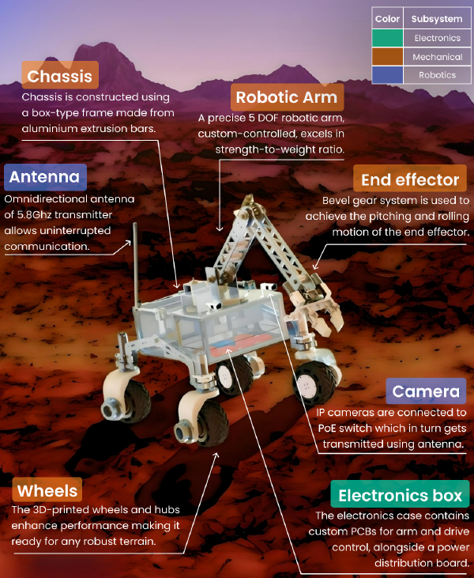

# VYOM: International Rover Challenge (IRC) Mars Rover

> **System Design and Development Review (SDDR)** for Team Vishwa (Veermata Jijabai Technological Institute - VJTI, Mumbai). Developed for the International Rover Challenge to execute instrument deployment, maintenance operations, reconnaissance, and astrobiology expeditions.

---

## Project Overview
Team Vishwa comprises undergraduate students collaborating across mechanical, electronics, robotics, and science domains to build a competitive, highly resilient Mars rover. The system balances structural rigidity with agility, utilizing a custom-integrated architecture for manual teleoperation and autonomous traversal.

* **Team Member / Contributor:** Mohammed Wafeeq Kazi[cite: 231]
* **Institution:** Veermata Jijabai Technological Institute (VJTI), Mumbai
* **Primary Competition:** International Rover Challenge (IRC) 2024 (Organized by Space Robotics Society at PSG iTech, Coimbatore)[cite: 231]

---

## Subsystem Architecture & Engineering Highlights

### 1. Mechanical Subsystem
* **Chassis:** Constructed using an aluminum extrusion box-type frame (Al 6063-T6) chosen for its optimal rigidity-flexibility ratio and corrosion resistance.
* **Suspension & Mobility:** Features an inverted-V suspension design for weight reduction and stability. Equipped with individual high-torque DC motors (120 kg-cm for driving, 50 kg-cm for steering) paired with planetary gearboxes and shock-absorbing TPU wheels.
* **Robotic Arm:** A 5-DOF articulated arm built from Al 6061 sheets. Uses planetary gear motors with a 15:1 worm gear reduction at the shoulder and joints, coupled with a bevel gear end-effector for precise pitching and rolling.

### 2. Electronics & Power Distribution
* **Custom PCBs:** Custom-designed STM32 breakout boards and motor driver circuits handling closed-loop PID control via OE37 magnetic encoders.
* **Power Architecture:** Centralized power distribution board utilizing adjustable voltage regulators and switching buck-boost converters fed by safe LiFePO4 batteries.
* **Communication:** Ubiquiti Rocket M5 operating on the 5.8 GHz frequency spectrum, delivering a 150 Mbps net data transfer rate for real-time HD video streaming and telemetry.

### 3. Robotics & Autonomy
* **Onboard Computing:** Powered by an NVIDIA Jetson Nano for heavy computational tasks including computer vision and path planning.
* **Navigation & Mapping:** Combines an Intel RealSense depth camera, IMU, and GPS data processed through an Extended Kalman Filter (EKF) to build real-time 2D occupancy grid maps using Gmapping and RTAB-map.
* **Computer Vision:** Utilizes OpenCV and Haar cascade classification for autonomous arrow detection and approach tracking.
* **Ground Station GUI:** Custom graphical interface built with Qt Creator and `qcustomplot.cpp` for real-time sensor data visualization and rover state monitoring.

### 4. Science Task & Astrobiology Expedition
* **Sampling Mechanism:** Dual-bucket scooping mechanism driven by 40 kg-cm worm gear motors to collect soil samples up to 5 cm depth.
* **On-Site Analysis:** Integrated ESP32 microcontrollers managing environmental sensors (DHT-11, MQ135, SHT-10, MLX90614, BMP-180). Includes automated test-tube rotation mechanisms and peristaltic pumps to execute chemical tests such as Schiff's test (for aldehydes) and Iodine tests (for carbohydrates).

---

## Documentation & Credentials ./Mini%20Project.pdf
* **[Download & Read Complete SDDR Report (PDF)](./TeamVishwa_SDDRReport1.pdf)**: Access the full 15-page design report featuring detailed milestone schedules, complete component budgets, electrical schematics, and mechanical CAD layouts.
* **[View Official IRC 2024 Certificate of Participation (PDF)](./assets/certificate_irc2024.pdf)**: Official verification of participation in the International Rover Challenge held at PSG iTech, Coimbatore[cite: 231].
